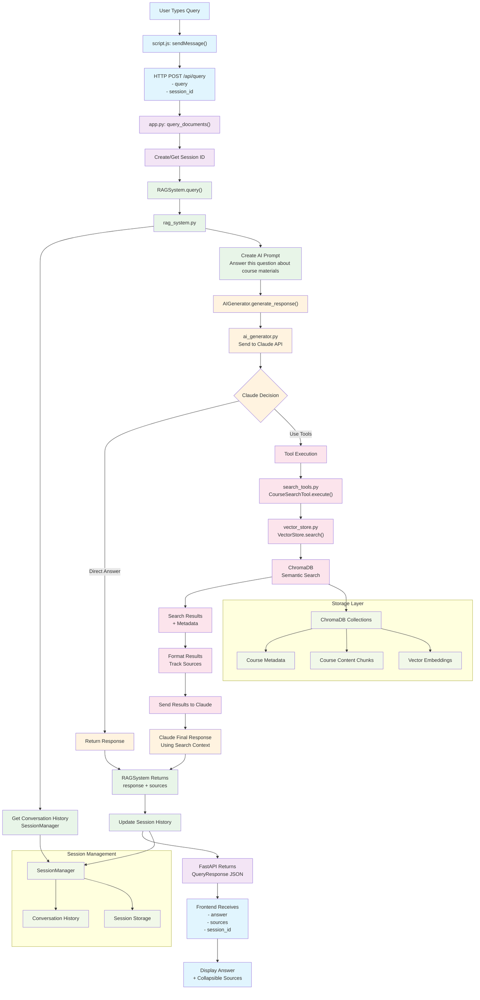

# RAG System Query Flow Diagram

## Key Components:

### 1. **Frontend Flow** (Blue)
- User interaction → HTTP request → Response display

### 2. **API Layer** (Purple) 
- FastAPI endpoint handling → Session management

### 3. **RAG Orchestration** (Green)
- Query processing → History management → Response coordination

### 4. **AI Processing** (Orange)
- Claude API interaction → Tool decision making

### 5. **Tool Execution** (Pink)
- Semantic search → Vector retrieval → Result formatting

### 6. **Storage Layer** (Light Green)
- ChromaDB collections → Course data → Embeddings

## Decision Points:
- **Claude Decision**: Direct answer vs tool usage
- **Tool Results**: Search success → Format → Send to Claude
- **Session Management**: History retrieval and updates

## Data Flow:
1. **Query**: User input → API → RAG → AI
2. **Tool Usage**: AI → Search → Vector DB → Results → AI
3. **Response**: AI → RAG → API → Frontend
4. **Sources**: Tracked through tool execution → UI display